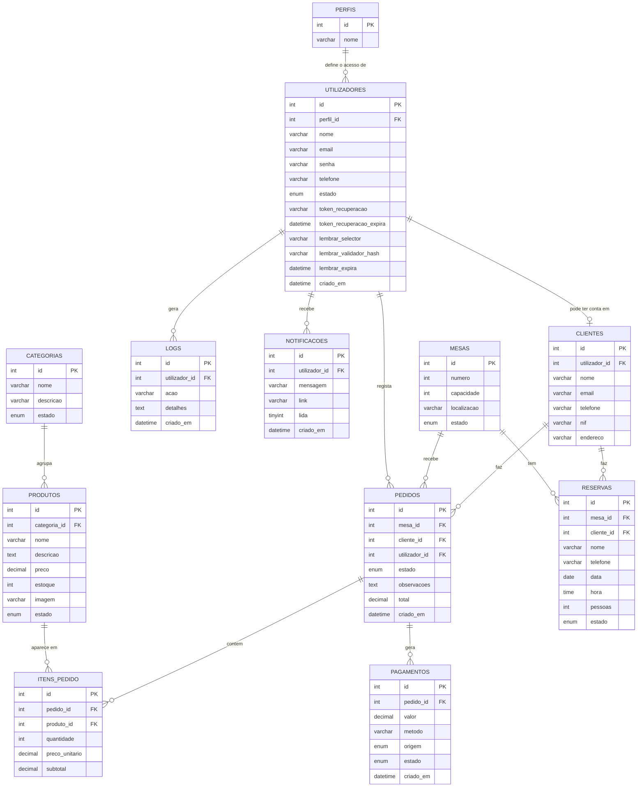

# Diagrama ER: Sabor Alma

Este é o modelo de dados do sistema. Doze tabelas: as dez pedidas no enunciado mais `reservas` e `notificacoes`, que são os itens bónus.

A lógica por trás das relações é simples: um `perfil` define o que um `utilizador` pode fazer no sistema (admin, operador ou cliente com conta). Um `utilizador` do tipo cliente pode ter um registo associado em `clientes` (guarda dados como NIF e endereço, que não fazem sentido para admin/operador). Um `pedido` pertence sempre a uma `mesa` e, opcionalmente, a um `cliente` registado (também aceitamos clientes de passagem, sem conta). Cada pedido tem vários `itens_pedido`, e cada item aponta para um `produto` do cardápio, que por sua vez está dentro de uma `categoria`. Um pedido pode gerar um ou mais `pagamentos` (por exemplo, se o cliente pagar parte em dinheiro e parte no cartão, ou se o próprio cliente pagar online). Ações sensíveis (login, eliminar um registo, alterar um pedido) ficam registadas em `logs`. `reservas` guarda marcações de mesa, associadas ou não a um cliente com conta. E `notificacoes` avisa Administrador/Operador quando algo novo acontece do lado do cliente.

O GitHub renderiza este diagrama automaticamente ao abrir este ficheiro.

## Decisões que vale a pena explicar

- **`perfis` tem só 3 registos fixos** (Administrador, Operador, Cliente), como pede o enunciado. Reparei que o protótipo da Clofia tinha perfis tipo "Gerente", "Caixa", etc. Isso vai ter de ser ajustado no formulário de utilizadores quando ligarmos ao backend, para usar só os 3 perfis oficiais.
- **`clientes.utilizador_id` é opcional e único**: nem todo cliente tem conta no sistema (pode ser um cliente de passagem, cadastrado só na hora do pedido), mas quando tem, cada conta corresponde a no máximo um registo de cliente.
- **`pedidos.cliente_id` e `pedidos.utilizador_id` aceitam NULL**: um pedido pode ser feito por um cliente sem conta (só mesa) e o operador que o registou pode não ser sempre relevante de guardar.
- **`preco_unitario` fica guardado em `itens_pedido`**, não só em `produtos`, porque o preço de um produto pode mudar no futuro e o histórico de pedidos antigos não pode mudar com ele.
- **Um pedido pode ter mais de um pagamento** (por isso `pagamentos` aponta para `pedidos` e não o contrário), para cobrir casos de pagamento dividido. O campo `origem` diz se foi o próprio cliente que pagou (fluxo automático) ou se foi o operador que registou o pagamento manualmente.
- **`notificacoes` é só para Administrador/Operador**: avisa quando surge um novo pedido ou reserva do lado do cliente, para não terem de ficar a atualizar as listas manualmente.
